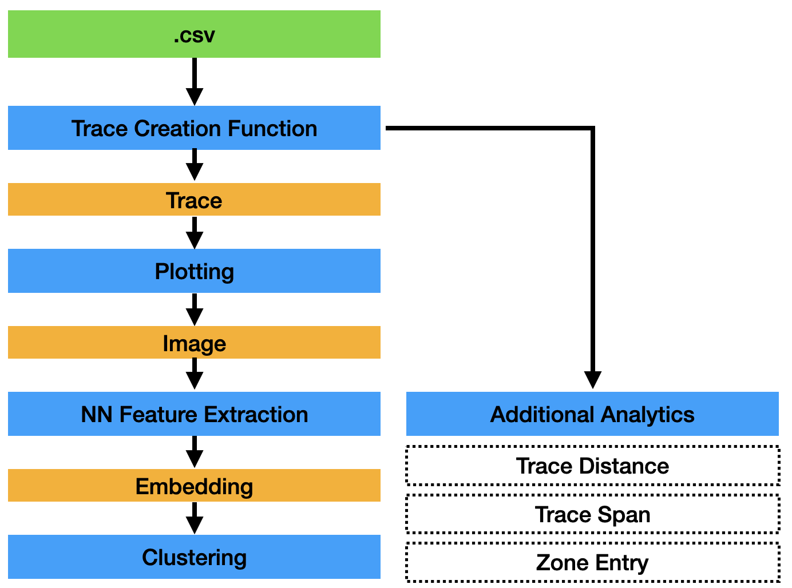

# Feature Extraction of Open Field Mouse Movement Data to Infer Intent
The goal of this project is to derive metrics from movement tracking data from behavior experiments. Namely, the entry patterns of mice into a zone of interest were isolated as 'traces', interpreted by a convolutional neural network and ultimately categorized by means of clustering using k-means. Various additonal metrics were also derived which can be viewed in the tableau dashboard hosted here:

https://public.tableau.com/app/profile/ethan3813/viz/Refactored_Behavior_Project/Dashboard1?publish=yes

The experiment paper can be viewed here:

https://www.nature.com/articles/s42003-023-04429-6
### Project Overview

#### Data Input Requirements
- #### Example File:
	- **File Type**: .csv
	- **Name**: C58_R10_ChR2_mPFC_30Hz_S01_P02_N_NON_NON
	- **Index Content**: 0_1_2_3_4_5_6_7_8_9
		- 0 - Animal ID 1
		- 1 - Animal ID 2
		- 2 - Virus
		- 3 - Stimulation Target
		- 4 - Stimulation Frequency
		- 5 - Session Number
		- 6 - Pod Number
		- 7 - Active (Stimulation) Zone
		- 8 - Sensitization Treatment
		- 9 - Sensitization Challenge
* *Notebooks currently handle the data columns in two different formats (as outputted by the AnyMaze software), and for future use it is important to specify which column format is being used. See prior data for the specifics of these formats.
