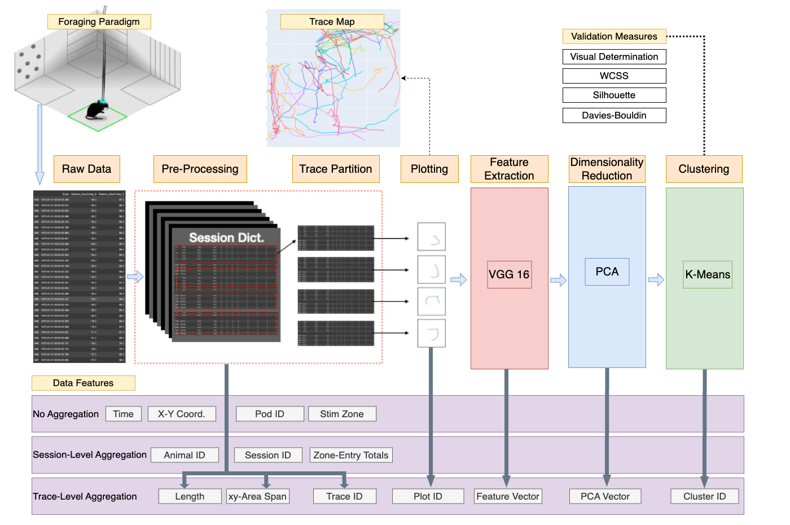
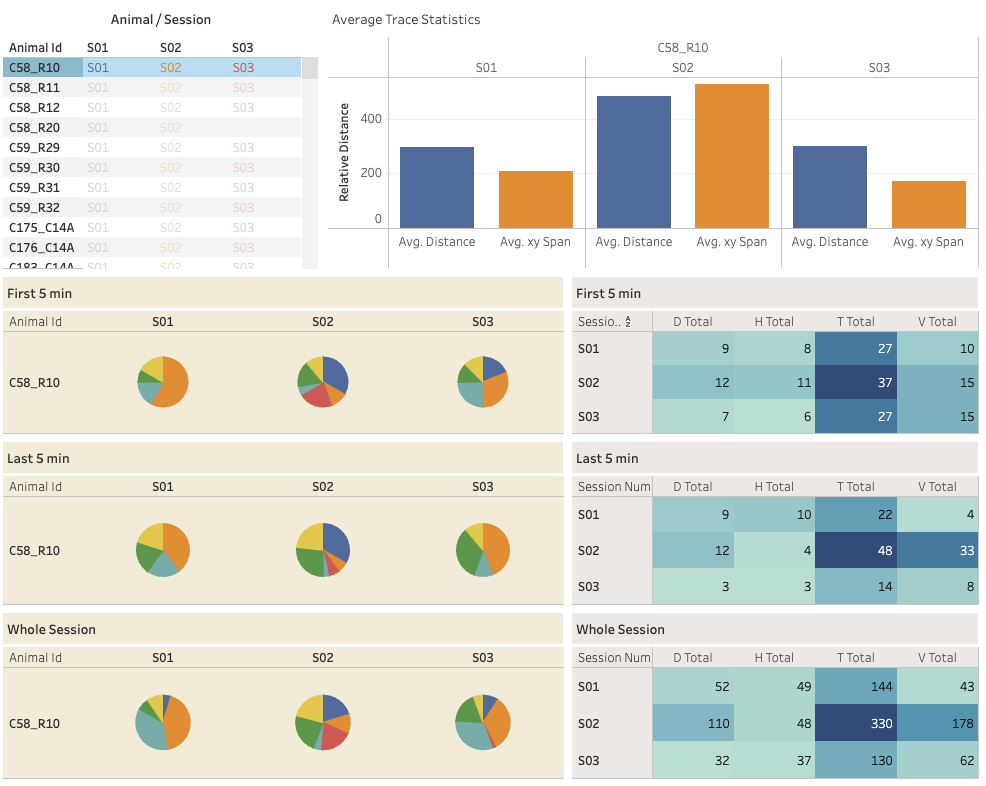

# Feature Extraction of Open Field Mouse Movement Data to Infer Intent
The goal of the following code is the feature extraction and analysis of time series movement data taken from a place-preference 'foraging' behavioral experiment paradigm. This analysis focused on the 5-second time interval prior to zone-entry for an animal during testing (hereby referred to as 'traces'). The primary project objectives were to:
- characterize traces with featurization and clustering as well as additional computed metrics.
- Analyze relative proportions of trace-clusters across different testing sessions for the same animal.

Feature extraction was achieved with 2-dimensional plotting, convolutional neural network vectorization (VGG16), dimensionality reduction (PCA) and finally clustering (K-Means) before final analysis. Additional trace metrics were also computed and added to the analysis which can be viewed in the links below.

### Project Overview

#### Tableau Dashboard

https://public.tableau.com/app/profile/ethan3813/viz/Refactored_Behavior_Project/Dashboard1?publish=yes

The study paper can be viewed here:

https://www.nature.com/articles/s42003-023-04429-6

- - - - - - - - - - - - - - - - - - - - - - - - - - - - - - - - - - - - - - - 
#### Data Input Notes
- #### Example File:
	- **File Type**: .csv
	- **Name**: C58_R10_ChR2_mPFC_30Hz_S01_P02_N_NON_NON
	- **Index Content**: 0_1_2_3_4_5_6_7_8_9
		- 0 - Animal ID 1
		- 1 - Animal ID 2
		- 2 - Virus
		- 3 - Stimulation Target
		- 4 - Stimulation Frequency
		- 5 - Session Number
		- 6 - Pod Number
		- 7 - Active (Stimulation) Zone
		- 8 - Sensitization Treatment
		- 9 - Sensitization Challenge
* *Notebooks currently handle the data columns in two different formats (as outputted by the AnyMaze software), and for future use it is important to specify which column format is being used. See prior data for the specifics of these formats.
